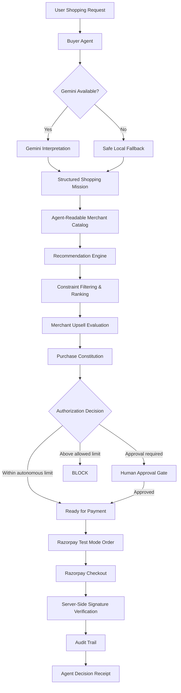

# 🛡️ AegisCart — The Trust Layer for Agentic Commerce

> **AI agents can shop for you, but they can't spend beyond your rules.**

AegisCart is an agentic-commerce prototype that allows an AI buyer to interpret a user's shopping intent, evaluate merchant products, enforce deterministic spending rules, block unsafe upsells, request human approval when required, initiate a Razorpay Test Mode checkout, and generate an explainable audit trail of the entire decision.

Built for the **Razorpay AI Buildathon 2026 — AI Growth & Agentic Commerce Track**.

---

## 💡 The Problem

AI agents are becoming capable of discovering products and making purchase decisions on behalf of users.

But giving an AI the ability to spend money introduces a critical trust problem:

**Who decides what the agent is actually allowed to buy?**

An AI model should not have unrestricted authority over financial actions.

For example:

- What if an AI chooses something above the user's budget?
- What if a merchant proposes an unnecessary upsell?
- What if the purchase amount requires human approval?
- What if the external AI service becomes unavailable?
- How can the user understand why a purchase was recommended?

AegisCart introduces a deterministic authorization layer between **AI reasoning** and **financial execution**.

---

# 🚀 How AegisCart Works

A user can provide a natural-language shopping mission such as:

> **“Find me a premium black abaya under ₹4,000 within 2 days. Quality matters more than the lowest price, and don't add unnecessary accessories.”**

AegisCart then:

1. Interprets the shopping request using the Buyer Agent.
2. Searches an agent-readable merchant catalog.
3. Rejects products violating hard constraints.
4. Ranks valid products according to user priorities.
5. Evaluates merchant upsells.
6. Applies the user's Purchase Constitution.
7. Requests human approval when necessary.
8. Creates a Razorpay Test Mode order only after authorization.
9. Verifies the Razorpay payment signature.
10. Generates an Agent Decision Receipt containing the audit trail.

---

# 🧠 Core Design Principle

## Probabilistic AI reasoning ≠ Financial authorization

AegisCart deliberately separates these responsibilities.

### AI is allowed to:

- Interpret natural-language shopping requests
- Understand preferences
- Rank suitable products
- Explain recommendations

### Deterministic code controls:

- Maximum budget
- Delivery constraints
- Spending limits
- Upsell limits
- Human approval requirements
- Whether payment execution is permitted

This means an LLM recommendation **cannot override the user's financial rules**.

---

# 🏗️ Architecture



---

# 🛡️ Purchase Constitution

The **Purchase Constitution** defines deterministic rules governing what the AI buyer is allowed to do.

Current prototype rules:

| Rule | Limit |
|---|---:|
| Autonomous purchase | ≤ ₹1,000 |
| Human approval required | ₹1,001 – ₹5,000 |
| Purchase blocked | > ₹5,000 |
| Maximum merchant upsell | 10% |
| Unknown merchant | Human approval required |

The AI cannot modify or bypass these rules.

---

# 🛍️ Example Agentic Checkout

For the demo request, the merchant **Luma** exposes an agent-readable catalog.

AegisCart evaluates multiple products and selects:

### Midnight Abaya

- Price: **₹3,599**
- Quality: **Premium**
- Delivery: **2 days**
- Color: **Black**

Other products are rejected when they violate the user's constraints.

For example:

**Onyx Luxe** → rejected because it exceeds the ₹4,000 budget.

**Everyday Black** → rejected because its 5-day delivery exceeds the requested 2-day limit.

---

# 🤖 AI Interpretation & Graceful Degradation

AegisCart uses a Gemini-powered Buyer Agent for natural-language interpretation.

However, an external AI service should never become a single point of failure for a financial workflow.

If Gemini becomes temporarily unavailable, rate-limited, or quota-limited, AegisCart can switch to a constrained local fallback parser.

The interface clearly identifies whether the mission was interpreted using:

**✦ Gemini Buyer Agent Active**

or

**🛡️ Safe AI Fallback Active**

Most importantly, the same deterministic Purchase Constitution continues to control authorization regardless of which interpretation path is used.

---

# 🛑 Merchant Upsell Protection

The merchant can propose an additional product, but it cannot silently increase the transaction amount.

In the demo:

**Base product:** ₹3,599  
**Merchant suggestion:** Premium Hijab — ₹699

The proposed upsell increases the purchase by approximately **19.4%**.

The Purchase Constitution allows a maximum upsell of **10%**.

Therefore AegisCart returns:

> **BLOCK — Upsell exceeds the user's permitted limit.**

The ₹699 item is **not added to the Razorpay order amount**.

---

# 👤 Human Approval Gate

The selected ₹3,599 purchase exceeds the ₹1,000 autonomous spending limit.

Instead of allowing the AI to purchase automatically, AegisCart changes the transaction state to:

```text
AWAITING_HUMAN_APPROVAL
```

Only after explicit human approval does it become:

```text
READY_FOR_PAYMENT
```

The payment workflow cannot begin before this authorization succeeds.

---

# 💳 Razorpay Integration

AegisCart integrates **Razorpay Test Mode** into the authorized checkout workflow.

The flow is:

```text
Purchase Constitution
        ↓
Human Approval
        ↓
Server creates Razorpay Order
        ↓
Razorpay Test Checkout
        ↓
Payment callback
        ↓
Server-side signature verification
```

Razorpay credentials remain server-side and are loaded using environment variables.

The `.env` file is excluded from Git using `.gitignore`.

### Important Prototype Note

`PAYMENT_VERIFIED` in the current prototype means that the **Razorpay payment signature has been successfully verified**.

It does not claim settlement or final merchant fulfillment.

---

# 🧾 Explainable Agent Decision Receipt

Financial agents should not only make decisions — they should be able to explain them.

AegisCart generates an **Agent Decision Receipt** showing:

- Selected product
- Authorized amount
- Merchant
- Rejected alternatives
- Merchant upsell evaluation
- Purchase Constitution decision
- Human approval
- Razorpay order creation
- Payment verification
- Complete decision timeline

This creates an auditable explanation of how the agent moved from a natural-language request to a financial action.

---

# 📸 Product Walkthrough

The following screenshots demonstrate AegisCart's complete agentic-commerce flow — from a natural-language shopping request to policy-controlled Razorpay Test Mode checkout and explainable transaction auditing.

---

## 1. AegisCart — Agentic Commerce Interface

The user begins by describing what they want to purchase in natural language.


---

## 2. Natural-Language Shopping Mission

Instead of manually applying filters, the user gives the AI buyer a shopping mission containing budget, delivery, quality, color, and preference constraints.


---

## 3. AI Buyer Decision

The Buyer Agent interprets the request, evaluates the agent-readable merchant catalog, filters products that violate hard constraints, and selects the best valid option.


AegisCart also exposes whether the request was interpreted by the Gemini Buyer Agent or by the safe local fallback.

---

## 4. Merchant Upsell Protection

The merchant proposes an additional item during checkout.

AegisCart independently evaluates the offer against the user's Purchase Constitution.

In the demo, a **₹699 Premium Hijab** represents approximately **19.4%** of the ₹3,599 base purchase.

Because the user's maximum permitted upsell is **10%**, AegisCart blocks it.


The blocked item is not added to the Razorpay order amount.

---

## 5. Purchase Constitution Enforcement

AegisCart evaluates the selected purchase using deterministic financial rules rather than allowing the LLM to authorize spending.

Purchases are handled according to three boundaries:

- **≤ ₹1,000:** autonomous purchase allowed
- **₹1,001–₹5,000:** human approval required
- **> ₹5,000:** purchase blocked

This demonstrates that AI recommendations and financial authorization remain separate.


---

## 6. Human Approval Gate

The selected **Midnight Abaya costs ₹3,599**, which exceeds the ₹1,000 autonomous spending limit.

AegisCart therefore pauses the transaction and requires explicit human approval before payment can begin.


---

## 7. Explicit User Confirmation

Protected financial actions remain under human control.

The transaction cannot proceed to payment until the required approval has been provided.


---

## 8. Razorpay Test Mode Checkout

Only after the transaction satisfies the Purchase Constitution and receives the required approval does AegisCart create a Razorpay order.

The prototype uses **Razorpay Test Mode**, so no real money is transferred.


---

## 9. Payment Processing

The authorized amount is passed to Razorpay's test checkout.

The merchant upsell that was blocked earlier is excluded from the payment amount.


---

## 10. Razorpay Test Transaction Success

The Razorpay Test Mode transaction completes through the simulated payment flow.


AegisCart then performs **server-side Razorpay signature verification** before marking the transaction as `PAYMENT_VERIFIED`.

> **Note:** `PAYMENT_VERIFIED` in this prototype means the Razorpay payment signature was successfully verified. It does not represent settlement or merchant fulfillment.

---

## 11. Explainable Agent Decision Receipt

After verification, AegisCart generates an **Agent Decision Receipt** containing the complete transaction decision trail.

The receipt records:

- Shopping mission
- Selected product
- Rejected alternatives
- Merchant upsell evaluation
- Purchase Constitution decision
- Human approval
- Razorpay order creation
- Payment verification
- Transaction state changes


This makes the agent's financial behavior **explainable, bounded, and auditable** rather than functioning as an opaque AI checkout.

# ⚠️ What Broke — And How I Recovered

One of the most important lessons while building AegisCart was that **AI infrastructure itself can fail**.

During development, the Gemini integration encountered multiple real API issues, including model availability problems and eventually a **429 quota-limit response**.

Initially, this meant the Buyer Agent could no longer interpret a shopping request.

Instead of treating the LLM as a dependency that the entire commerce workflow must trust, I redesigned the interpretation layer to degrade gracefully.

AegisCart now:

- Detects retryable AI failures
- Attempts supported model paths
- Falls back to a constrained local parser when required
- Keeps financial authorization completely independent from the LLM

The important realization was:

> **AI failure should reduce intelligence — not reduce financial safety.**

Even when Gemini is unavailable, the fallback interpretation still passes through the same deterministic budget, delivery, upsell, approval, and payment authorization rules.

---

# 🧪 Testing

AegisCart includes automated tests covering critical financial and transaction rules.

Current test result:

```text
29 passed
```

Tests cover areas including:

- Purchase policy decisions
- Autonomous spending boundaries
- Approval requirements
- Blocked transactions
- Upsell protection
- Product recommendation
- Transaction workflow
- Human approval
- Razorpay order creation
- Payment signature verification
- Agentic checkout behavior

---

# 🧰 Technology Stack

### Frontend

- React
- Vite
- JavaScript
- CSS

### Backend

- Python
- FastAPI

### AI

- Gemini API
- Structured AI interpretation
- Deterministic local fallback

### Payments

- Razorpay Test Mode
- Server-side order creation
- Server-side signature verification

### Data & Infrastructure

- JSON agent-readable merchant catalog
- In-memory transaction store
- REST APIs
- Git & GitHub

---

# 📁 Project Structure

```text
aegiscart-ai/
│
├── backend/
│   ├── main.py
│   ├── buyer_agent.py
│   ├── agentic_checkout.py
│   ├── recommendation_engine.py
│   ├── policy_engine.py
│   ├── transaction_service.py
│   ├── approval_service.py
│   ├── payment_service.py
│   ├── decision_receipt.py
│   ├── audit_service.py
│   └── catalog_service.py
│
├── data/
│   ├── catalog.json
│   └── user_policy.json
│
├── docs/
│   └── images/
│
├── frontend/
│   └── src/
│
├── tests/
│
├── .env.example
├── .gitignore
└── README.md
```

---

# ⚙️ Running AegisCart Locally

## 1. Clone the repository

```bash
git clone https://github.com/khadeejasohakhan/aegiscart-ai.git
cd aegiscart-ai
```

## 2. Configure environment variables

Create a `.env` file in the project root using `.env.example` as a reference.

```env
GEMINI_API_KEY=your_gemini_api_key
RAZORPAY_KEY_ID=your_razorpay_test_key_id
RAZORPAY_KEY_SECRET=your_razorpay_test_key_secret
```

Never commit the real `.env` file.

## 3. Start the backend

```bash
uvicorn backend.main:app --reload
```

Backend:

```text
http://127.0.0.1:8000
```

## 4. Start the frontend

```bash
cd frontend
npm install
npm run dev
```

Open the URL displayed by Vite.

---

# 🔐 Security Principles

AegisCart follows several important design rules:

- LLM output does not directly authorize payments.
- Spending rules are deterministic.
- High-value purchases require explicit human approval.
- Merchant upsells are independently validated.
- Razorpay Secret is never exposed to the frontend.
- Payment signatures are verified server-side.
- `.env` is excluded from source control.
- Financial decisions are recorded in an audit trail.

---

# 🚧 Current Prototype Limitations

AegisCart is a buildathon prototype rather than a production payment system.

Current limitations include:

- Merchant catalog is synthetic.
- Transactions are stored in memory.
- Razorpay runs in Test Mode.
- `PAYMENT_VERIFIED` represents signature verification, not settlement.
- Local fallback interpretation supports a limited shopping vocabulary.
- Production authentication and persistent user accounts are outside the current MVP.

These boundaries are intentionally documented rather than hidden.

---

# 🔮 Future Direction

A production version of AegisCart could support:

- Multiple merchants
- Persistent Purchase Constitutions
- Merchant trust scores
- User-specific spending policies
- Agent-readable catalogs across merchants
- Subscription authorization policies
- Payment-status webhooks
- Persistent transaction storage
- Multi-agent buyer/merchant negotiation

The long-term goal is to provide a **trust and authorization layer between autonomous AI agents and digital commerce infrastructure**.

---

# 🏁 Closing Idea

AI agents will increasingly be able to search, compare, negotiate, and transact.

The challenge is not simply making them capable of spending money.

The challenge is making that spending:

**bounded, explainable, auditable, and controlled by the user.**

That is what AegisCart is designed to explore.

> **AegisCart — AI agents can shop for you, but they can't spend beyond your rules.**